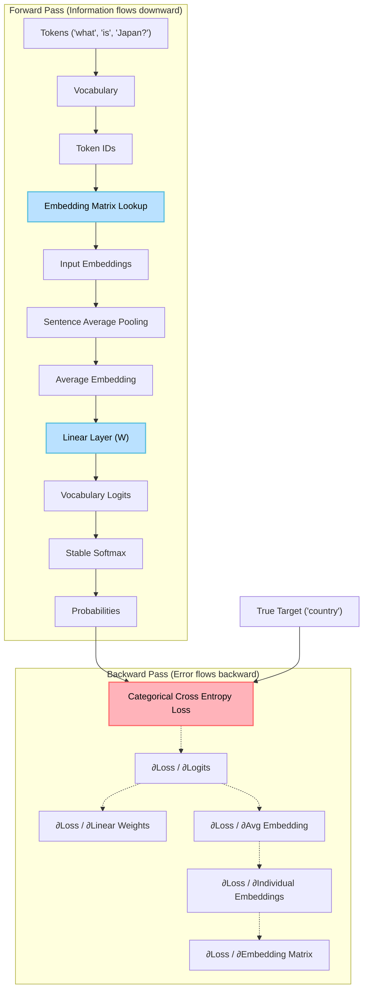

# Lab 002: Embedding Training Findings

## How do embeddings become meaningful?

If the embedding layer is just a matrix lookup, how does the network know what values to put in that matrix?
Embeddings are not magical vectors that inherently understand language.
At the end of the day, all these things are mathematical operations.

To figure out how word representations actually learn, I implemented a complete training pipeline from scratch:
- Vocabulary & tokenization
- Trainable embedding matrix
- Embedding lookup
- Sentence pooling (Average)
- Linear output layer
- Stable Softmax
- Categorical Cross Entropy
- Manual backpropagation
- Gradient descent updates

---

## The Core Experiment

**Training Output:** [training_results.json](../../results/lab_002_embeddings/training_results.json)
**Source Code:** [embedding_training.py](../../labs/lab-002-embeddings/embedding_training.py)

I trained a small model to predict a target word given an input sentence. Over the course of 1000 epochs, I observed how the embedding vectors shifted to reduce the prediction loss.

### The Training Pipeline Architecture

Here is what I found, broken down into key observations:

### Observation 1 - Embeddings update based on downstream prediction loss

An embedding vector does not become meaningful by itself. It becomes meaningful because updating it reduces the prediction loss of a downstream task.

During the forward pass, information flows downward (Token IDs $\rightarrow$ Embedding $\rightarrow$ Linear Layer $\rightarrow$ Logits $\rightarrow$ Loss). When training, we ask "Who caused this loss?", and the error flows backward.

Backpropagation doesn't explicitly say "change embeddings to mean X". It just computes the gradient ("If this weight changes a tiny bit, how much does the loss change?"). The embedding matrix is just another trainable layer that receives these gradients.

### Observation 2 - Logits are just raw evidence scores

The linear layer outputs a shape of `(vocab_size,)`. These are logits - the raw scores or unnormalized evidence for every possible output token.

A high logit simply means: *"Among all the words I know, this token currently has the strongest evidence of being the next token."* or *"How compatible is my sentence representation with every word in the vocabulary?"*

### Observation 3 - Stable Softmax is a computational necessity

Why did I need to implement `stable_logits = logits - np.max(logits)`?
Because Softmax involves exponents ($e^x$). If a logit is large, say 1244, $e^{1244}$ is humongous and will result in `NaN` (infinity) on a computer. Since Softmax only cares about *relative* differences between scores, subtracting the maximum value keeps the math stable without changing the final probabilities.

### Observation 4 - Cross Entropy measures "Surprise"

Cross-Entropy calculates how far apart your model's guess is from the absolute truth. It measures how "surprised" the model is by the correct answer. The worse the model's guess, the higher the score.

In our results, the initial loss was around 3.39 (Target probability: ~0.033). After 1000 epochs, the probability of the correct target word climbed to 0.98, showing the model was no longer surprised, and the embeddings had successfully aligned with the goal.

### Observation 5 - The curious case of Weight Tying

A typical transformer has an Embedding Matrix (e.g., 50257 $\times$ 768) and an Output Matrix (768 $\times$ 50257). Many LLMs actually share these weights! This is called **weight tying**. Instead of learning two separate huge matrices, they reuse the same knowledge base to map tokens to vectors and vectors back to tokens.

### Final Takeaway

As seen in the results, over the course of 1000 epochs, the gradient itself adjusted the embedding row to find the correct result. The target probability climbs dramatically as the embedding matrix is updated.

However, since I used pooling (averaging) to combine embeddings, I destroyed the relationships between the tokens in the sequence. To fix this, we need a mathematical layer that finds relationships between words without losing their order or context...
